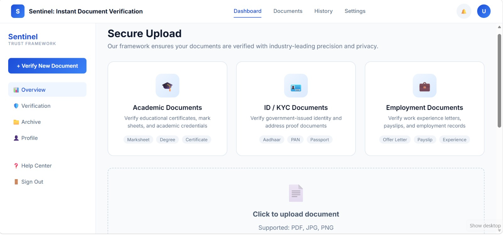
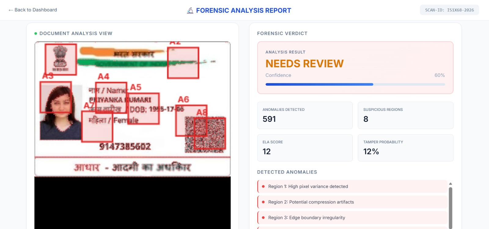
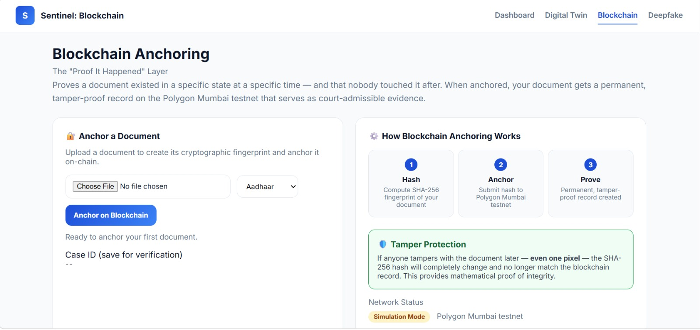
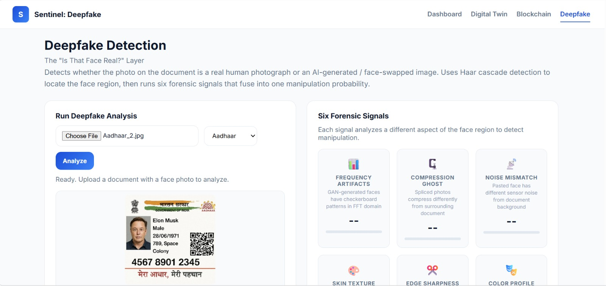
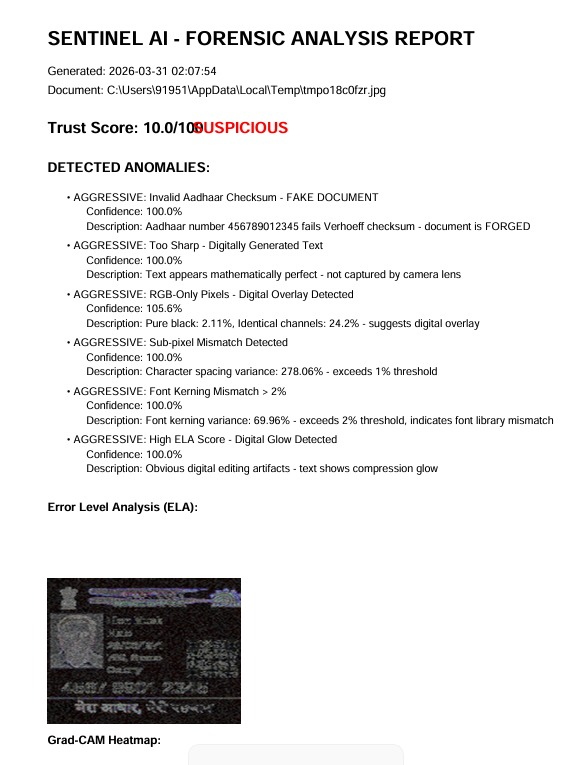

# Sentinel AI Neural Engine - Forensic Document Analysis
## Overview

Sentinel AI is an **AI-assisted document verification / fraud detection system**.

It combines:

- **Forensic image analysis** (ELA, structural checks, DCT/artifact checks, OCR-based validations)
- A lightweight **CNN model** (TensorFlow/Keras) for tamper probability scoring
- **Pretrained detectors/validators** (YOLO + OCR + rules) for PAN/Aadhaar/certificates
- A **multi-agent (agentic) pipeline** that fuses signals into a single `trust_score` + `status`
- An optional **Sentinel Module** for:
  - blockchain anchoring (simulation mode or Polygon Mumbai)
  - deepfake detection
  - digital-twin deviation heatmap

This repo contains both the **Flask API backend** and a **static HTML dashboard**.

---

## Demo (local)

- **Backend (API)**: `http://127.0.0.1:5001`
- **Frontend (static)**: `http://localhost:3000/dashboard.html`

### Pages

- Dashboard: `http://localhost:3000/dashboard.html`
- Forensic view: `http://localhost:3000/forensic.html`
- Digital Twin: `http://localhost:3000/digital_twin.html`
- Blockchain: `http://localhost:3000/blockchain.html`
- Deepfake: `http://localhost:3000/deepfake.html`

---

## Screenshots

### Dashboard Interface


### Forensic Document Analysis


### Blockchain Integration


### Deepfake Analysis


### Report Generation


---

## Key Features

### Forensic Engine

- **Error Level Analysis (ELA)**
- **OCR extraction** (Tesseract) + ID-format checks
- **Checksum validation** (e.g., Verhoeff for Aadhaar)
- **Grad-CAM heatmap overlay** (MobileNetV2-based attention)
- **PDF report generation**

### ML Scoring

- **Binary CNN (Keras)** for forgery probability
- Converts probability to a **trust score (0–100)**
- Graceful fallback if model can’t load

### Agentic Pipeline

Backend agents run in a fixed order:

- **RouterAgent** → detects document type
- **ForensicAgent** → runs `forensic_engine.py`
- **ValidationAgent** → runs pretrained validators + extracts fields/bboxes
- **MLAgent** → runs CNN scoring (`ml_engine.py`)
- **DecisionAgent** → fuses scores into `trust_score` + `status`
- **LLMReasoningAgent** → optional Gemini explanation (`ai_reasoning`)
- **ReportAgent** → summary/report object

### Optional Sentinel Module

If `sentinel_module/` is available and configured, the API also supports:

- Blockchain anchoring (simulation or Polygon Mumbai)
- Deepfake detector
- Digital-twin deviation comparison + heatmap

---

## Repository Structure

```text
senitel ai/
├── api_server.py                 # Flask API backend
├── forensic_engine.py            # Core forensic engine + Grad-CAM + PDF report
├── agents/                       # Agentic pipeline
├── ml_engine.py                  # Loads ml/model.h5 and runs predictions
├── ml/                           # Training scripts + model.h5
├── models/                       # YOLO weights + pretrained validators
├── sentinel_module/              # Optional module: blockchain + deepfake + digital twin
├── dashboard.html                # Main UI
├── forensic.html                 # Forensic view
├── deepfake.html                 # Deepfake UI
├── digital_twin.html             # Digital twin UI
├── blockchain.html               # Blockchain UI
├── script.js                     # Frontend JS
├── style.css                     # Frontend styles
└── requirements.txt              # Python dependencies
```

---

## Setup

### Prerequisites

- Python **3.9+**
- Tesseract OCR

#### Install Tesseract (Windows)

1. Download: https://github.com/UB-Mannheim/tesseract/wiki
2. Install to default path (`C:\Program Files\Tesseract-OCR\`)
3. (Optional) set env var:

```powershell
$env:TESSERACT_CMD = "C:\Program Files\Tesseract-OCR\tesseract.exe"
```

### Create environment + install deps

```powershell
python -m venv venv
.\venv\Scripts\Activate.ps1
python -m pip install --upgrade pip
pip install -r requirements.txt
```

---

## Run

### 1) Start the backend (Flask API)

```powershell
.\venv\Scripts\Activate.ps1
python api_server.py
```

Backend runs on:

- `http://127.0.0.1:5001`

### 2) Start the frontend (static server)

Open a new terminal in the project root:

```powershell
python -m http.server 3000
```

Open:

- `http://localhost:3000/dashboard.html`

---

## API Endpoints (high level)

### Health

- `GET /api/health`

### Core forensic analysis

- `POST /api/analyze`
  - Request: JSON `{ "image_data": "data:image/...base64..." }`
  - Response keys (common):
    - `trust_score`, `status`, `ela_score`
    - `anomalies`, `anomaly_count`
    - `ocr_text`
    - `heatmap` / `heatmap_url`

### Sentinel module (optional)

- `GET /api/sentinel/health`
- `POST /api/sentinel/analyze` (multipart `file` + `doc_type`)
- `GET /api/sentinel/cases`
- `GET /api/sentinel/verify/<tx_hash>`
- `POST /api/sentinel/vault/commit`
- `POST /api/sentinel/vault/verify`
- `POST /api/sentinel/integrity`

---

## Models

### Forensic CNN (Grad-CAM)

- In `forensic_engine.py`
- Uses **MobileNetV2 (ImageNet weights)** as a feature backbone
- Generates a heatmap overlay for visual explainability

### CNN fraud model (Keras)

- File: `ml/model.h5`
- Training script: `ml/train.py`
- Dataset loader: `ml/utils.py` (expects `ml_data/`)

### Pretrained detectors

This repo includes scripts to download pretrained weights:

- Aadhaar YOLOv8: `download_models.py`
  - Hugging Face: `arnabdhar/YOLOv8-nano-aadhar-card`
- PAN detector: `download_pan_model.py`
  - Hugging Face: `foduucom/pan-card-detection`

### Downloading model weights (recommended)

If you don’t want to commit large weights to GitHub, download them after cloning:

```powershell
python download_models.py
python download_pan_model.py
```

If you *do* want to commit weights, use **Git LFS** for:

- `models/*.pt`
- `ml/model.h5`

---

## Dataset Notes

The training code expects local datasets. **Do not commit any sensitive personal documents**.

- `Dataset/` and `ml_data/` are ignored by default via `.gitignore`.
- If you want to share an example dataset layout, commit only:
  - empty folders
  - or a few non-sensitive sample images
  - or a `DATASET.md` describing how to obtain/build the dataset

---

## Environment variables

### Gemini (optional)

Create `.env` in repo root:

```env
GEMINI_API_KEY=YOUR_KEY
```

### Sentinel module blockchain (optional)

Use `sentinel_module/.env.example` and create `sentinel_module/.env` locally.

---

## Troubleshooting

### OCR not working

- Ensure Tesseract is installed
- Set `TESSERACT_CMD` environment variable (Windows)

### Model load issues

- TensorFlow/Keras `.h5` compatibility can vary between versions.
- The code is designed to run with graceful fallbacks.

---

## Credits / Attribution

- TensorFlow/Keras, OpenCV, Tesseract OCR
- YOLOv8 + Ultralytics
- Pretrained model sources (download scripts):
  - `arnabdhar/YOLOv8-nano-aadhar-card` (Hugging Face)
  - `foduucom/pan-card-detection` (Hugging Face)
